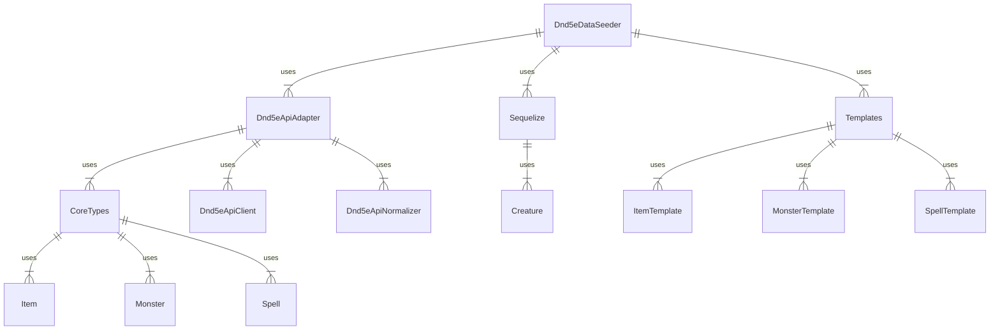

# dataPopulation

This module sets up patterns for pulling data from third party dnd resources, normalizing them, and saving that data as MarkdownEntity objects.

## Adding a new source of data

Create the following files and directories

- /mySource
  - MySourceApiAdapter.ts ( `class implements IThirdPartyDndAdapter` )
  - MySourceApiClient.ts ( Handle communication with third party resource )
  - MySourceNormalizer.ts ( `async getMyResources(): Promise<MyResource[]>` Return type pulled from `./types` )
  - index.ts ( export all public files here )
  - types.ts ( define source specific types to be mapped to core types )

## Module Structure

